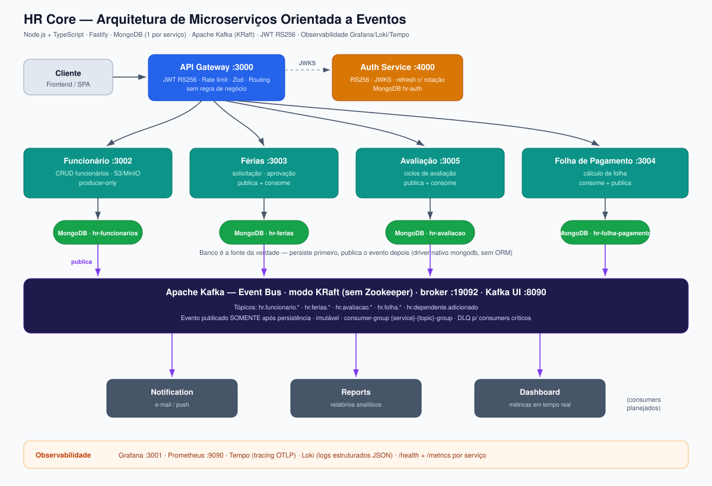

# HR Core

> Plataforma de Recursos Humanos _enterprise_, construída com arquitetura de **microserviços orientada a eventos**.
> Gestão de funcionários, férias, avaliações e folha de pagamento — escalável, segura, modular e preparada para SaaS.

---

## Sumário

- [Arquitetura](#arquitetura)
- [Decisões de tecnologia (e o porquê)](#decisões-de-tecnologia-e-o-porquê)
- [Estrutura do repositório](#estrutura-do-repositório)
- [Serviços e portas](#serviços-e-portas)
- [Pré-requisitos](#pré-requisitos)
- [Execução do projeto](#execução-do-projeto)
- [Variáveis de ambiente](#variáveis-de-ambiente)
- [Rotas do API Gateway](#rotas-do-api-gateway)
- [Eventos Kafka](#eventos-kafka)
- [Testes](#testes)
- [Observabilidade](#observabilidade)
- [Convenções](#convenções)

---

## Arquitetura



O sistema é um **monorepo pnpm** com microserviços independentes. Cada serviço tem **banco próprio** (MongoDB), **deploy próprio** e **responsabilidade única**. A comunicação síncrona request/response passa pelo **API Gateway**; a comunicação assíncrona entre domínios passa pelo **event bus Kafka**.

### Princípios inegociáveis

- **API Gateway não contém regra de negócio** — apenas autenticação, autorização, rate limiting, validação (Zod) e roteamento.
- **Cada microserviço é totalmente independente** — banco próprio, deploy próprio, sem banco compartilhado.
- **Kafka é comunicação assíncrona** — nunca substitui HTTP síncrono em fluxos request/response.
- **Fluxo de eventos:** salva no banco → publica evento no Kafka → consumidores reagem.
- **O banco é sempre a fonte da verdade** — nunca inferir estado apenas a partir de eventos.

---

## Decisões de tecnologia (e o porquê)

| Camada              | Escolha                                                 | Por que                                                                                                                                                                                                                                          |
| ------------------- | ------------------------------------------------------- | ------------------------------------------------------------------------------------------------------------------------------------------------------------------------------------------------------------------------------------------------ |
| **Runtime**         | Node.js (≥ 22.11) + TypeScript `strict`                 | Ecossistema maduro para I/O assíncrono; tipagem como documentação executável e barreira de defeitos em tempo de compilação.                                                                                                                      |
| **Package manager** | **pnpm** (workspaces)                                   | `node_modules` por _content-addressable store_ (menos disco, instalação rápida) e suporte nativo a monorepo. **npm/yarn são proibidos** no projeto.                                                                                              |
| **Framework HTTP**  | **Fastify**                                             | Mais performático que Express, _schema-based_ (casa com Zod via `fastify-type-provider-zod`), plugins encapsulados e logger estruturado nativo.                                                                                                  |
| **Banco de dados**  | **MongoDB** (1 por serviço), **driver nativo**          | Modelo de documento flexível para agregados de RH. **ORM é proibido** (sem Mongoose/Prisma) — queries puras via `Db`/`Collection` mantêm controle total sobre índices e aggregation, sem abstração escondendo custo.                             |
| **Event bus**       | **Apache Kafka** em modo **KRaft**                      | Log durável, particionado e com replay — ideal para _event-driven_ e desacoplamento entre serviços. **KRaft** elimina o Zookeeper (menos um componente para operar). Cliente: `kafkajs`.                                                         |
| **Validação**       | **Zod**                                                 | Schema único que valida input HTTP e deriva tipos TypeScript; respostas de erro seguem **RFC 7807**.                                                                                                                                             |
| **AuthN/AuthZ**     | **JWT RS256** + JWKS                                    | Auth Service detém a chave privada (assina); demais serviços validam localmente com a pública via JWKS (**Zero Trust**). Refresh token com **rotação** e revogação em cascata. Hash de senha com `crypto`/scrypt nativo (sem bcrypt por padrão). |
| **Observabilidade** | **Grafana + Loki + Tempo + Prometheus** (OpenTelemetry) | Logs estruturados em JSON (Loki), tracing distribuído entre serviços (Tempo via OTLP) e métricas (Prometheus) — pilar único de telemetria, instrumentado por OTel.                                                                               |
| **Testes**          | **Vitest** (+ Testcontainers)                           | Rápido, compatível com ESM/TS sem config extra. Integração contra **MongoDB e Kafka reais** via Testcontainers — sem mocks de infraestrutura.                                                                                                    |
| **CI/CD**           | **GitHub Actions + Argo CD**                            | Pipeline (lint → typecheck → testes → build) no Actions; deploy GitOps com Argo CD (merge em `main` dispara sync).                                                                                                                               |

---

## Estrutura do repositório

```
hr-core/
├── services/
│   ├── api-gateway/        # JWT, rate limit, Zod, routing (sem regra de negócio)
│   ├── auth/               # emissão/validação de JWT RS256, refresh com rotação
│   ├── funcionario/        # CRUD de funcionários (+ S3/MinIO para anexos)
│   ├── ferias/             # solicitação e aprovação de férias
│   ├── avaliacao/          # ciclos de avaliação
│   └── folha-pagamento/    # cálculo de folha
├── infra/
│   └── docker-compose.kafka.yml   # event bus Kafka (KRaft) + Kafka UI, compartilhado
├── argocd/ · manifests/    # GitOps / Kubernetes
├── image/                  # diagramas de arquitetura
├── pnpm-workspace.yaml
└── CLAUDE.md               # guia de contexto e padrões do projeto
```

Cada serviço segue a mesma estrutura interna:

```
src/
 ├── config/            # env (Zod) e constantes
 ├── modules/
 │    ├── domain/       # entidades, value objects, erros de domínio
 │    ├── controllers/  # handlers HTTP (Fastify)
 │    ├── services/     # lógica de negócio
 │    ├── repositories/ # acesso ao MongoDB (driver nativo)
 │    └── schemas/      # validação Zod
 ├── infrastructure/messaging/   # kafka-client, event-publisher, event-consumer, topics
 ├── middlewares/       # auth, error handler (RFC 7807), logging
 ├── app.ts             # registro de plugins e rotas
 └── server.ts          # bootstrap
```

---

## Serviços e portas

| Serviço             | Porta HTTP (host)              | MongoDB (host) | Banco                | Papel no Kafka        |
| ------------------- | ------------------------------ | -------------- | -------------------- | --------------------- |
| **api-gateway**     | `3000`                         | —              | —                    | —                     |
| **auth**            | `4000`                         | `27017`        | `hr-auth`            | —                     |
| **funcionario**     | `3002`                         | `27018`        | `hr-funcionarios`    | _producer_            |
| **ferias**          | `3003`                         | `27019`        | `hr-ferias`          | _producer + consumer_ |
| **avaliacao**       | `3005` → `3004`                | `27020`        | `hr-avaliacao`       | _producer + consumer_ |
| **folha-pagamento** | `3004`                         | `27021`        | `hr-folha-pagamento` | _consumer + producer_ |
| **Kafka (infra)**   | `19092` (broker) · `8090` (UI) | —              | —                    | event bus             |

> Cada `docker-compose.yml` de serviço sobe também seu MongoDB, exporters e (em alguns) Tempo/Prometheus/Grafana próprios, em **portas que não colidem** entre stacks. O Kafka é um stack **compartilhado** (`infra/docker-compose.kafka.yml`).

---

## Pré-requisitos

- **Node.js ≥ 22.11**
- **pnpm ≥ 11** (`corepack enable` recomendado)
- **Docker** + **Docker Compose** (para bancos, Kafka e observabilidade)

---

## Execução do projeto

### 1. Instalar dependências

```bash
pnpm install
```

> O `prepare` configura o Husky (hooks de commit) e o template de mensagem de commit automaticamente.

### 2. Subir o event bus Kafka (compartilhado)

Suba uma única vez — todos os serviços conectam nele:

```bash
docker compose --project-directory . -f infra/docker-compose.kafka.yml up -d
```

- Broker: `localhost:19092`
- Kafka UI: <http://localhost:8090>
- Os tópicos `hr.*` são criados automaticamente pelo job `kafka-init`.

Para derrubar (e limpar volumes): troque `up -d` por `down -v`.

### 3. Subir um serviço com sua infraestrutura

Cada serviço expõe scripts `compose:*`. Pelo filtro do pnpm:

```bash
# Auth precisa subir primeiro (emite os JWTs que os demais validam)
pnpm --filter @hr-core/auth compose:up

# Demais serviços
pnpm --filter @hr-core/funcionario     compose:up
pnpm --filter @hr-core/ferias          compose:up
pnpm --filter @hr-core/avaliacao       compose:up
pnpm --filter @hr-core/folha-pagamento compose:up
pnpm --filter @hr-core/api-gateway     compose:up
```

Logs e teardown:

```bash
pnpm --filter @hr-core/<serviço> compose:logs
pnpm --filter @hr-core/<serviço> compose:down
```

### 4. (Alternativa) Modo desenvolvimento no host

Rode os serviços localmente em watch mode (precisa dos bancos/Kafka via compose):

```bash
pnpm dev                                   # todos em paralelo
pnpm --filter @hr-core/funcionario dev     # apenas um serviço
```

### 5. Popular dados (seed)

Serviços com seed expõem o script `seed`:

```bash
pnpm --filter @hr-core/auth        seed
pnpm --filter @hr-core/funcionario seed
pnpm --filter @hr-core/ferias      seed
```

### 6. Acessar

- **Gateway:** <http://localhost:3000> · Swagger em `/docs`
- **Coleção Postman:** `hr-core.postman_collection.json` na raiz.

---

## Variáveis de ambiente

Cada serviço tem um `.env.example` documentando suas variáveis — copie para `.env`:

```bash
cp services/auth/.env.example services/auth/.env
```

Destaques:

| Variável                                       | Onde                                  | Significado                                                                    |
| ---------------------------------------------- | ------------------------------------- | ------------------------------------------------------------------------------ |
| `PORT` / `HOST`                                | todos                                 | bind do servidor HTTP                                                          |
| `MONGO_URL` / `MONGO_DB_NAME`                  | serviços de dados                     | conexão e banco próprio                                                        |
| `AUTH_JWKS_URL`                                | gateway + serviços                    | endpoint da chave pública para validar JWT                                     |
| `AUTH_PRIVATE_KEY_PATH`                        | auth                                  | chave RSA PKCS#8 (em dev, gera in-memory se ausente)                           |
| `KAFKA_ENABLED`                                | funcionario, ferias, avaliacao, folha | `true` publica/consome no broker; `false` usa `LogEventPublisher` (sem broker) |
| `KAFKA_BROKERS`                                | idem                                  | default `host.docker.internal:19092`                                           |
| `OTEL_ENABLED` / `OTEL_EXPORTER_OTLP_ENDPOINT` | todos                                 | tracing distribuído (Tempo)                                                    |

> Com `KAFKA_ENABLED=false`, um serviço sobe e funciona sem o broker — útil para desenvolvimento isolado.

---

## Rotas do API Gateway

O gateway reescreve `/api/v1/*` para o serviço correspondente (removendo o prefixo `/api/v1`):

| Prefixo no gateway           | Serviço de destino                              |
| ---------------------------- | ----------------------------------------------- |
| `/api/v1/funcionarios`       | funcionario (`FUNCIONARIO_SERVICE_URL`)         |
| `/api/v1/ferias`             | ferias (`FERIAS_SERVICE_URL`)                   |
| `/api/v1/avaliacoes`         | avaliacao (`AVALIACAO_SERVICE_URL`)             |
| `/api/v1/folha-de-pagamento` | folha-pagamento (`FOLHA_PAGAMENTO_SERVICE_URL`) |

---

## Eventos Kafka

Convenções: tópicos no padrão `hr.<dominio>.<fato>`; evento publicado **somente após** persistência; consumer-groups nomeados `{service}-{topic}-group`; DLQ para consumers críticos; payloads **imutáveis**.

| Evento (tópico)                                                                        | Produtor        | Consumidores                               |
| -------------------------------------------------------------------------------------- | --------------- | ------------------------------------------ |
| `hr.funcionario.criado`                                                                | funcionario     | ferias, avaliacao, folha-pagamento         |
| `hr.funcionario.desligado`                                                             | funcionario     | folha-pagamento                            |
| `hr.funcionario.salario-alterado`                                                      | funcionario     | folha-pagamento                            |
| `hr.ferias.solicitadas` / `aprovadas` / `rejeitadas` / `canceladas` / `gozo-concluido` | ferias          | folha-pagamento, (Notification, Dashboard) |
| `hr.avaliacao.criada` / `atualizada`                                                   | avaliacao       | (Reports, Dashboard)                       |
| `hr.folha.aberta` / `processada` / `aprovada` / `paga` / `fechada`                     | folha-pagamento | (Notification, Reports)                    |

> Serviços entre parênteses são consumidores **planejados** (Notification, Reports, Dashboard).

---

## Testes

Stack: **Vitest** (unit) e **Testcontainers** (integração contra MongoDB/Kafka reais).

```bash
pnpm test                                            # todos os serviços
pnpm --filter @hr-core/folha-pagamento test          # um serviço
pnpm --filter @hr-core/ferias test:integration       # integração (sobe containers)
pnpm --filter @hr-core/<serviço> test:coverage       # cobertura
pnpm --filter @hr-core/<serviço> e2e                 # end-to-end (quando disponível)
```

**Regras:** todo _service method_ tem teste unitário; repositories testados contra banco real; cobertura mínima de **80%** em `services/` e `domain/`.

---

## Observabilidade

Todo serviço expõe `GET /health` (probes do Argo CD/Kubernetes) e `GET /metrics` (Prometheus).

| Ferramenta     | Função                     | Acesso (stack do api-gateway) |
| -------------- | -------------------------- | ----------------------------- |
| **Grafana**    | dashboards                 | <http://localhost:3001>       |
| **Prometheus** | métricas                   | <http://localhost:9090>       |
| **Tempo**      | tracing distribuído (OTLP) | porta `3200` / OTLP `4318`    |
| **Loki**       | logs estruturados JSON     | via Grafana                   |

> Logs sempre em **JSON estruturado** (logger nativo do Fastify), nunca `console.log` em produção. Campos obrigatórios: `service`, `traceId`, `level`, `message`.

---

## Convenções

- **Commits:** Conventional Commits com `commitlint` e _scope-enum_ estrito (escopos: serviços, pacotes compartilhados e meta como `deps`/`ci`/`docs`). Hooks de pré-commit rodam `eslint --fix` + `prettier` via `lint-staged`.
- **Erros HTTP:** **RFC 7807** (`type`, `title`, `status`, `detail`).
- **TypeScript:** `strict: true`, sem `any` sem justificativa.
- **MongoDB:** driver nativo apenas — **sem ORM**.
- Mais detalhes de padrões e regras de negócio em [`CLAUDE.md`](./CLAUDE.md), [`CONTRIBUTING.md`](./CONTRIBUTING.md) e [`SECURITY.md`](./SECURITY.md).

---

## Licença

Distribuído sob a licença **AGPL-3.0-or-later**. Veja [`LICENSE`](./LICENSE).
