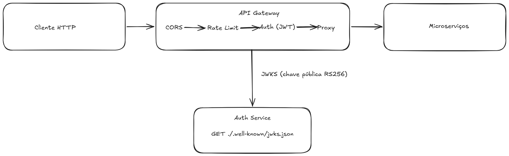

# @hr-core/api-gateway

> API Gateway do HR Core — ponto de entrada HTTP único para os microserviços de Funcionário, Férias, Avaliação e Folha de Pagamento.

Responsável **exclusivamente** por autenticação JWT, autorização baseada em roles, rate limiting, CORS, observabilidade e roteamento. **Não contém regra de negócio nem acesso a banco de dados.**

---

## Onde a API está rodando

> **A API responde porque está rodando no container Docker.** Não no `pnpm dev`.

Quando você `curl http://localhost:3000/health` e recebe `200 OK`, o pacote está chegando no container **`hr-core-api-gateway`** (porta do host `3000` mapeada via `docker-compose.yml`). O processo Node lá dentro está rodando o **JS compilado**:

```
node --import ./dist/tracing.js dist/server.js
```

Verificar a qualquer momento:

```bash
docker ps --filter "name=hr-core-api-gateway$" --format "{{.Names}}: {{.Status}}"
# → hr-core-api-gateway: Up X minutes (healthy)

docker exec hr-core-api-gateway ps aux | grep node
# → 1 node ... node --import ./dist/tracing.js dist/server.js
```

### Implicações práticas

1. **`pnpm dev` em paralelo vai falhar** com `EADDRINUSE: 0.0.0.0:3000` — o container já está ocupando a porta. Veja [Execução](#execução) para os 3 caminhos de contorno.
2. **Alterar código fonte não tem efeito imediato** — você está vendo o `dist/` antigo do container. Pra refletir mudanças, ou rebuilde a imagem (`pnpm compose:up`) ou pare o container e use `pnpm dev`.
3. **O `.env` na raiz do workspace não é lido pelo container** — variáveis vêm do bloco `environment:` do `docker-compose.yml`. Editar `.env` só afeta `pnpm dev` no host.

---

## Sumário

- [Visão geral](#visão-geral)
- [Arquitetura](#arquitetura)
- [Stack](#stack)
- [Requisitos](#requisitos)
- [Instalação](#instalação)
- [Configuração](#configuração)
- [Execução](#execução)
- [Estrutura do projeto](#estrutura-do-projeto)
- [Fluxo de requisição](#fluxo-de-requisição)
- [Anatomia dos módulos principais](#anatomia-dos-módulos-principais)
- [Endpoints](#endpoints)
- [Documentação OpenAPI / Swagger](#documentação-openapi--swagger)
- [Formato de erro (RFC 7807)](#formato-de-erro-rfc-7807)
- [Autorização (RBAC)](#autorização-rbac)
- [Observabilidade](#observabilidade)
- [Grafana — credenciais e dashboard](#grafana--credenciais-e-dashboard)
- [Docker](#docker)
- [Stack local com Docker Compose](#stack-local-com-docker-compose)
- [Testes](#testes)
- [Testes E2E](#testes-e2e)
- [Qualidade de código](#qualidade-de-código)
- [Convenções](#convenções)
- [Adicionando um novo serviço downstream](#adicionando-um-novo-serviço-downstream)
- [Roadmap](#roadmap)

---

## Visão geral

O API Gateway é o _front-door_ HTTP do HR Core. Toda requisição externa passa por ele e segue um pipeline determinístico antes de ser despachada ao microserviço correspondente:

1. **CORS** — valida o cabeçalho `Origin` no preflight
2. **Métricas** — observa duração e contagem por rota/status
3. **Rate limit** — limita requisições por IP em uma janela deslizante
4. **Autenticação** — valida o JWT (RS256) usando a chave pública obtida do Auth Service via JWKS
5. **Autorização (RBAC)** — opcional por rota via `fastify.requireRole(...)`
6. **Proxy** — encaminha a requisição ao serviço de destino, propagando headers de tracing e identidade

Erros, em qualquer ponto do pipeline, respondem no formato **RFC 7807** (`application/problem+json`), preservando o `traceId` da requisição.

---

## Arquitetura



O gateway é **stateless**. Não mantém sessão, não acessa banco, não consome Kafka. As únicas dependências externas são:

- **Auth Service** (JWKS) — chave pública para validar tokens, cacheada em memória
- **Collector OpenTelemetry** (opcional) — recebe traces via OTLP HTTP
- **Microserviços downstream** — alvos do proxy

---

## Stack

| Camada              | Tecnologia                                                                                                                                |
| ------------------- | ----------------------------------------------------------------------------------------------------------------------------------------- |
| Runtime             | Node.js ≥ 22.11                                                                                                                           |
| Package manager     | pnpm ≥ 11.0 (workspaces)                                                                                                                  |
| Framework HTTP      | [Fastify](https://fastify.dev) 5                                                                                                          |
| Proxy               | [`@fastify/http-proxy`](https://github.com/fastify/fastify-http-proxy)                                                                    |
| CORS                | [`@fastify/cors`](https://github.com/fastify/fastify-cors)                                                                                |
| Rate limit          | [`@fastify/rate-limit`](https://github.com/fastify/fastify-rate-limit) (in-memory)                                                        |
| HTTP errors helpers | [`@fastify/sensible`](https://github.com/fastify/fastify-sensible)                                                                        |
| JWT (RS256 + JWKS)  | [`jose`](https://github.com/panva/jose)                                                                                                   |
| Validação           | [`zod`](https://zod.dev) 4 + [`fastify-type-provider-zod`](https://github.com/turkerdev/fastify-type-provider-zod)                        |
| Documentação        | [`@fastify/swagger`](https://github.com/fastify/fastify-swagger) + [`@fastify/swagger-ui`](https://github.com/fastify/fastify-swagger-ui) |
| Logs                | [`pino`](https://getpino.io) (built-in do Fastify) + `pino-pretty` (dev)                                                                  |
| Tracing             | [`@opentelemetry/sdk-node`](https://opentelemetry.io/docs/languages/js/) + OTLP                                                           |
| Métricas            | [`fastify-metrics`](https://github.com/SkeLLLa/fastify-metrics) + `prom-client`                                                           |
| Testes              | [`vitest`](https://vitest.dev) 4 + coverage v8                                                                                            |
| Lint / Format       | [`eslint`](https://eslint.org) 10 (flat config) + [`prettier`](https://prettier.io) 3                                                     |
| Build               | TypeScript 6 (`tsc`) com `strict` máximo                                                                                                  |
| Containerização     | Docker (multi-stage build, Node 22 alpine)                                                                                                |

---

## Requisitos

- **Node.js** ≥ 22.11 (`engines.node`)
- **pnpm** ≥ 11.0 (`packageManager`)
- Acesso de rede ao **Auth Service** (para baixar o JWKS)
- URLs HTTP dos **microserviços downstream** que se deseja expor
- **Docker** (opcional, para build da imagem de runtime)
- **OpenTelemetry Collector** (opcional, se `OTEL_ENABLED=true`)

---

## Instalação

A partir da raiz do monorepo:

```bash
pnpm install
cp services/api-gateway/.env.example services/api-gateway/.env
```

Edite o `.env` com as URLs reais do Auth Service e dos microserviços.

---

## Configuração

Todas as variáveis de ambiente são validadas em runtime via Zod no boot. **Comportamento fail-fast**: se algo obrigatório faltar ou estiver malformado, o processo aborta antes de aceitar conexões, com uma mensagem listando cada variável inválida.

### Runtime

| Variável    | Default       | Descrição                                                                |
| ----------- | ------------- | ------------------------------------------------------------------------ |
| `NODE_ENV`  | `development` | `development` \| `production` \| `test`                                  |
| `HOST`      | `0.0.0.0`     | Interface de bind                                                        |
| `PORT`      | `3000`        | Porta TCP                                                                |
| `LOG_LEVEL` | `info`        | `fatal` \| `error` \| `warn` \| `info` \| `debug` \| `trace` \| `silent` |

### Auth (obrigatórias)

| Variável            | Descrição                                                          |
| ------------------- | ------------------------------------------------------------------ |
| `AUTH_JWKS_URL`     | URL do JWKS. Ex.: `http://auth-service:4000/.well-known/jwks.json` |
| `AUTH_JWT_ISSUER`   | Claim `iss` esperado nos tokens                                    |
| `AUTH_JWT_AUDIENCE` | Claim `aud` esperado nos tokens                                    |

A chave pública é buscada uma única vez por `kid` e mantida em cache (TTL **10 min**, cooldown **30 s**). Rotação de chave no Auth Service é transparente — sem redeploy do gateway.

### Rate limit

| Variável               | Default | Descrição                          |
| ---------------------- | ------- | ---------------------------------- |
| `RATE_LIMIT_MAX`       | `100`   | Requisições permitidas na janela   |
| `RATE_LIMIT_WINDOW_MS` | `60000` | Tamanho da janela em milissegundos |

> **Atenção:** o backend é **in-memory** por instância. Contador não é compartilhado entre pods. Para produção multi-instância, substituir pelo backend Redis.

### CORS

| Variável           | Default | Descrição                                                            |
| ------------------ | ------- | -------------------------------------------------------------------- |
| `CORS_ORIGINS`     | `""`    | `""` = desabilitado · `*` = libera todos · `a.com,b.com` = allowlist |
| `CORS_CREDENTIALS` | `false` | Permite envio de cookies / `Authorization` em requests cross-origin  |
| `CORS_MAX_AGE`     | `86400` | Cache do resultado do preflight no navegador, em segundos            |

> **Atenção:** `CORS_ORIGINS=*` **combinado com** `CORS_CREDENTIALS=true` é proibido pela spec do CORS — o navegador rejeita.

### Swagger / OpenAPI

| Variável               | Default | Descrição                                                                                              |
| ---------------------- | ------- | ------------------------------------------------------------------------------------------------------ |
| `SWAGGER_ENABLED`      | `true`  | Liga/desliga geração da spec OpenAPI e a Swagger UI. Em produção, desligar se a exposição for pública. |
| `SWAGGER_ROUTE_PREFIX` | `/docs` | Prefixo onde a Swagger UI é montada. `${prefix}/json` serve a spec em JSON.                            |

> **Atenção:** quando `SWAGGER_ENABLED=false`, nem `/docs` nem `/docs/json` são registrados — qualquer GET responde 404 RFC 7807.

### OpenTelemetry

| Variável                      | Default       | Descrição                                                                 |
| ----------------------------- | ------------- | ------------------------------------------------------------------------- |
| `OTEL_ENABLED`                | `false`       | Liga o SDK Node + auto-instrumentations                                   |
| `OTEL_SERVICE_NAME`           | `api-gateway` | Nome do serviço reportado nos spans                                       |
| `OTEL_EXPORTER_OTLP_ENDPOINT` | _(opcional)_  | URL base do Collector (sem `/v1/traces`). Ex.: `http://tempo:4318`        |
| `OTEL_RESOURCE_ATTRIBUTES`    | _(opcional)_  | CSV de atributos extras. Ex.: `deployment.environment=prod,team=platform` |

> **Nota:** o auto-instrumentation hooka `http`, `undici` (proxy) e `pino` (logs com `traceId`). Para spans específicos do Fastify, adicionar `@opentelemetry/instrumentation-fastify` no array de `instrumentations` em `src/tracing.ts`.

### Microserviços downstream

| Variável                      | Obrigatória | Prefixo HTTP exposto         |
| ----------------------------- | :---------: | ---------------------------- |
| `FUNCIONARIO_SERVICE_URL`     |     Sim     | `/api/v1/funcionarios`       |
| `FERIAS_SERVICE_URL`          |      —      | `/api/v1/ferias`             |
| `AVALIACAO_SERVICE_URL`       |      —      | `/api/v1/avaliacoes`         |
| `FOLHA_PAGAMENTO_SERVICE_URL` |      —      | `/api/v1/folha-de-pagamento` |

Serviços não definidos não registram rota — o gateway responde 404 para o prefixo correspondente. O `/v1` é uma decisão do gateway: os downstreams recebem o path **sem** a versão (ex.: `/api/v1/funcionarios/abc` → `/funcionarios/abc` no upstream).

---

## Execução

> Antes de tudo: **a API que está respondendo em `http://localhost:3000` é o container**, não o `pnpm dev`. Veja [Onde a API está rodando](#onde-a-api-está-rodando) para o contexto completo.

Todos os comandos podem ser rodados:

- **a partir do diretório do serviço** (`cd services/api-gateway`), ou
- **a partir da raiz** com filtro (`pnpm --filter @hr-core/api-gateway <script>`).

### Modo 1 — Container (default, está rodando agora)

```bash
pnpm compose:up      # build + sobe a stack (gateway + mock + observabilidade)
pnpm compose:logs    # logs em follow
pnpm compose:down    # derruba + apaga volumes
```

Roda `node --import ./dist/tracing.js dist/server.js` dentro de `hr-core-api-gateway`. **Sem hot-reload** — cada mudança em `src/` exige `compose:up` novamente (rebuild ~30-60s).

### Modo 2 — `pnpm dev` (hot-reload, exige porta livre)

`tsx watch src/server.ts` no host. Reinicia a cada alteração e formata logs com `pino-pretty`.

Antes de rodar a primeira vez:

```bash
# 1. .env é OBRIGATÓRIO — sem ele, env.ts faz fail-fast no boot
cd services/api-gateway
cp .env.example .env

# 2. Liberar a porta 3000 (o container ainda está ocupando)
docker stop hr-core-api-gateway
```

Depois:

```bash
pnpm dev
```

- `tsx watch` reinicia o processo a cada alteração em `src/`
- Logs formatados pelo `pino-pretty`
- Tracing **desligado por padrão** (`OTEL_ENABLED=false` no `.env.example`)

### Modo 3 — Híbrido (Recomendado para dev ativo)

Mantém mock-backend + Tempo + Prometheus + Grafana no compose, mas roda o gateway localmente com hot-reload:

```bash
docker stop hr-core-api-gateway   # derruba só o gateway (mantém o resto)
cd services/api-gateway
cp .env.example .env              # se ainda não existe
pnpm dev
```

Agora você tem hot-reload + observabilidade real funcionando (métricas no Prometheus de `localhost:9090`, dashboard no Grafana de `localhost:3001`).

### Modo 4 — Produção (binário compilado)

```bash
pnpm build      # tsc emite JS + d.ts em ./dist
pnpm start      # node --import ./dist/tracing.js dist/server.js
```

O `--import` preloada o módulo de tracing **antes** de qualquer outro `import` (`fastify`, `http`, `undici`). Isso é obrigatório em ESM para o auto-instrumentation do OpenTelemetry conseguir hookar.

### Lint, format e typecheck

```bash
pnpm lint              # eslint .
pnpm lint:fix          # eslint . --fix
pnpm format            # prettier --write .
pnpm format:check      # prettier --check .
pnpm typecheck         # tsc --noEmit (recursivo via workspace)
```

`pnpm typecheck`, `pnpm test`, `pnpm build` na raiz rodam recursivamente em todos os workspaces. `pnpm lint` e `pnpm format` rodam apenas na raiz e varrem o monorepo inteiro.

### Outros scripts

```bash
pnpm test            # vitest run (single pass)
pnpm test:watch      # vitest em modo watch
pnpm test:coverage   # roda testes e gera relatório de cobertura
```

### Sinais

`SIGTERM` e `SIGINT` disparam shutdown gracioso: o Fastify drena conexões em curso, fecha os plugins (`onClose` hooks), o SDK do OpenTelemetry faz flush dos spans pendentes, e o processo sai com código 0. Falhas durante o shutdown saem com código 1.

---

## Estrutura do projeto

```
services/api-gateway/
├── .env                       # configuração local (gitignored)
├── .env.example               # template versionado
├── .dockerignore              # exclui dist/node_modules/testes do build context
├── Dockerfile                 # multi-stage build (deps → build → prod-deps → runtime)
├── docker/                    # configs montadas nos containers do compose
│   ├── grafana-datasources.yml  # Prometheus + Tempo (UIDs explícitos)
│   ├── grafana-dashboards.yml   # provider de dashboards (file-based)
│   ├── dashboards/              # JSONs provisionados (HR Core folder)
│   │   └── api-gateway.json
│   ├── prometheus.yml           # scrape do gateway (target api-gateway:3000)
│   └── tempo.yaml               # config do Tempo (OTLP HTTP em 4318)
├── package.json               # @hr-core/api-gateway
├── tsconfig.json              # estende o tsconfig do monorepo (typecheck + lint)
├── tsconfig.build.json        # restringe rootDir e excludes para o tsc emitir só src/
├── vitest.config.ts           # config dos testes + thresholds de cobertura
├── test/
│   └── setup.ts               # injeta env vars antes dos testes
└── src/
    ├── server.ts              # bootstrap + handlers de sinal
    ├── app.ts                 # buildApp(): fábrica do Fastify
    ├── tracing.ts             # OpenTelemetry SDK (auto-inicia no --import)
    ├── config/
    │   └── env.ts             # schema Zod + parser fail-fast
    ├── middlewares/
    │   └── error-handler.ts   # error & not-found handlers (RFC 7807) + mapa status→type
    ├── plugins/
    │   ├── cors.ts            # @fastify/cors
    │   ├── metrics.ts         # fastify-metrics + prom-client (/metrics)
    │   ├── rate-limit.ts      # @fastify/rate-limit
    │   ├── auth.ts            # JWT via JWKS (jose) + decorator fastify.authenticate
    │   ├── auth.test.ts       # caminhos negativos do auth
    │   ├── rate-limit.test.ts # limite e estouro
    │   ├── cors.test.ts       # preflight com/sem origin permitida
    │   ├── metrics.test.ts    # /metrics serve formato Prometheus
    │   ├── rbac.ts            # decorator fastify.requireRole(role|role[])
    │   └── swagger.ts         # @fastify/swagger + swagger-ui (/docs)
    └── routes/
        ├── health.ts          # /health, /ready
        ├── health.test.ts     # testes das rotas públicas
        └── proxy.ts           # @fastify/http-proxy para cada downstream
```

---

## Fluxo de requisição

```
Cliente
  │
  ▼
┌────────────────────────────────────────────────────────────────────────┐
│  CORS         (plugins/cors.ts)                                        │
│   - Valida Origin no preflight                                         │
│   - Desabilitado se CORS_ORIGINS estiver vazio                         │
└────────────────────────────────────────────────────────────────────────┘
  │
  ▼
┌────────────────────────────────────────────────────────────────────────┐
│  Metrics      (plugins/metrics.ts)                                     │
│   - Coleta histogram/summary de duração por rota e status              │
│   - Expõe /metrics (formato Prometheus)                                │
└────────────────────────────────────────────────────────────────────────┘
  │
  ▼
┌────────────────────────────────────────────────────────────────────────┐
│  Rate limit   (plugins/rate-limit.ts)                                  │
│   - Janela deslizante por IP                                           │
│   - Responde 429 + RFC 7807 quando excedido                            │
└────────────────────────────────────────────────────────────────────────┘
  │
  ▼
┌────────────────────────────────────────────────────────────────────────┐
│  Auth         (plugins/auth.ts, preHandler nas rotas de proxy)         │
│   - Extrai Bearer do header Authorization                              │
│   - jwtVerify(token, JWKS, { issuer, audience })                       │
│   - Popula request.user = { sub, roles }                               │
└────────────────────────────────────────────────────────────────────────┘
  │
  ▼
┌────────────────────────────────────────────────────────────────────────┐
│  RBAC         (plugins/rbac.ts, preHandler opcional por rota)          │
│   - fastify.requireRole('admin' | ['admin','hr'])                      │
│   - Responde 403 + RFC 7807 quando role não bate                       │
└────────────────────────────────────────────────────────────────────────┘
  │
  ▼
┌────────────────────────────────────────────────────────────────────────┐
│  Proxy        (routes/proxy.ts)                                        │
│   - Encaminha a request ao upstream do prefixo                         │
│   - Reescreve o path (ex.: /api/v1/funcionarios → /funcionarios)       │
│   - Injeta x-trace-id, x-user-id, x-user-roles                         │
└────────────────────────────────────────────────────────────────────────┘
  │
  ▼
Microserviço downstream
```

Qualquer exceção lançada em qualquer estágio é capturada pelo error handler global (`middlewares/error-handler.ts`) e respondida como `application/problem+json`.

### Headers propagados ao downstream

| Header         | Origem                                          | Uso no microserviço          |
| -------------- | ----------------------------------------------- | ---------------------------- |
| `x-trace-id`   | `request.id` (header de entrada ou UUID gerado) | Correlação em logs / tracing |
| `x-user-id`    | claim `sub` do JWT                              | Identificação do ator        |
| `x-user-roles` | claim `roles` do JWT (lista CSV)                | Autorização granular         |

### Identidade dentro do gateway

Dentro de qualquer rota ou hook do gateway:

```ts
request.id // string — traceId
request.user?.sub // string | undefined — id do usuário autenticado
request.user?.roles // readonly string[] — roles do JWT
```

`request.user` é `undefined` em rotas públicas e populado pelo `preHandler` `fastify.authenticate` em rotas que requerem autenticação (todas as rotas de proxy).

---

## Anatomia dos módulos principais

Detalhamento dos quatro arquivos que sustentam o pipeline do gateway. Linhas referenciadas valem para o estado atual do repositório.

### `src/app.ts` — fábrica do servidor Fastify

Exporta uma única função `buildApp(): Promise<FastifyInstance>`. A separação entre construção (`app.ts`) e bootstrap (`server.ts`) é proposital: `buildApp` é reutilizada pelos testes (`app.inject(...)`) sem subir socket TCP.

#### Configuração do Fastify

- **Logger Pino** com `base: { service: 'api-gateway' }` — todo log carrega o campo `service`, atendendo ao padrão de logs estruturados do projeto.
- Em `NODE_ENV=development`, o transport `pino-pretty` formata para humano. Em qualquer outro ambiente, JSON puro destinado ao Loki.
- **`genReqId`** — se o header `x-trace-id` chega na request (propagado por outro hop), reaproveita; senão gera `randomUUID()`. Isso torna `request.id` o **traceId** efetivo que aparece em todos os logs do Pino e é repassado adiante pelo proxy.
- **`trustProxy: true`** — necessário para honrar `X-Forwarded-For` quando o gateway está atrás de LB/ingress (caso contrário o rate-limit por IP sempre vê o IP do proxy).
- **`disableRequestLogging: false`** — request/response logging habilitado.

#### Ordem de registro (importa)

| #   | Item                   | Por que nessa posição                                        |
| --- | ---------------------- | ------------------------------------------------------------ |
| 1   | `registerErrorHandler` | Antes de tudo, para capturar erros de plugins durante o boot |
| 2   | `sensible`             | Habilita `fastify.httpErrors.*` usado pelos demais plugins   |
| 3   | `metrics`              | Cedo, para instrumentar todas as rotas registradas depois    |
| 4   | `cors`                 | Antes do rate-limit (preflight não deve consumir cota)       |
| 5   | `rate-limit`           | Antes do auth (proteção contra brute-force no JWT)           |
| 6   | `auth`                 | Decora `fastify.authenticate`                                |
| 7   | `rbac`                 | Depende de `request.user` populado pelo auth                 |
| 8   | `healthRoutes`         | Público, sem auth                                            |
| 9   | `proxyRoutes`          | Consome `fastify.authenticate` como preHandler               |

A função é `async` porque todos os `register` retornam promise — o encadeamento sequencial garante a ordem acima. Imports usam extensão `.js` (`./config/env.js`) por exigência do `module: NodeNext` + `verbatimModuleSyntax`.

---

### `src/routes/proxy.ts` — roteamento HTTP para microsserviços

#### Modelo de rota

```ts
interface DownstreamRoute {
  readonly prefix: string // caminho público no gateway
  readonly rewritePrefix: string // caminho real no downstream
  readonly upstream: string // URL base do microsserviço
}
```

Tudo `readonly` — as rotas são montadas uma vez no boot e são imutáveis a partir daí.

#### `buildRoutes()`

- **`funcionarios` é obrigatório** (`FUNCIONARIO_SERVICE_URL` marcada como `z.url()` em `env.ts`) — sempre entra na lista.
- **`ferias`, `avaliacoes`, `folha-de-pagamento` são opcionais** (`z.url().optional()`): só registram rota se a env existir. Isso permite subir o gateway em ambientes parciais sem 502 nos prefixos ausentes — o que falta vira 404 RFC 7807 via `setNotFoundHandler`.
- **Rewrite explícito**: `/api/v1/funcionarios/123` → upstream recebe `/funcionarios/123`. O gateway controla a versão da API publicamente (`/api/v1/*`); os serviços downstream não precisam saber dela.

#### `proxyRoutes` — registro do `@fastify/http-proxy`

Para cada `DownstreamRoute`, registra uma instância de `@fastify/http-proxy` com:

- **`preHandler: fastify.authenticate`** — toda rota de proxy exige JWT válido. As rotas públicas (`/health`, `/ready`, `/metrics`) não passam por aqui.
- **`rewriteRequestHeaders`** injeta no downstream três headers que materializam o contrato Zero Trust:

| Header         | Valor                        | Uso no downstream                  |
| -------------- | ---------------------------- | ---------------------------------- |
| `x-trace-id`   | `request.id`                 | Correlação de logs e traces        |
| `x-user-id`    | `request.user?.sub ?? ''`    | Identificação do ator autenticado  |
| `x-user-roles` | `request.user?.roles` em CSV | Autorização local no microsserviço |

Em runtime, se `authenticate` falha o preHandler aborta antes do `rewriteRequestHeaders`, então o `?? ''` é defesa em profundidade — `request.user` é tipado como opcional no plugin de auth.

#### Conformidade com os padrões arquiteturais

- Zero regra de negócio — só roteamento e propagação de identidade.
- Suporta Zero Trust: gateway valida JWT, downstream pode re-validar localmente.
- Trace propagado end-to-end via `x-trace-id`.

#### Gaps conhecidos

- **Sem rota explícita para o Auth Service** — login e refresh token rotation, embora previstos na arquitetura do projeto, não têm prefixo dedicado aqui. Vale registrar se forem expostos via gateway.
- **Sem `timeout` por rota** — usa defaults do `@fastify/http-proxy`. Para produção vale ajustar (downstream lento não deve segurar o gateway indefinidamente).
- **Sem `proxyPayloads: false`** — body é bufferizado por padrão, o que impede streaming em payloads grandes. Trocar para `false` se houver endpoints de upload no roadmap.

---

### `src/plugins/auth.ts` — autenticação JWT com JWKS

Plugin Fastify registrado via `fastify-plugin` (escopo global — os decorators ficam visíveis em toda a app).

#### Augmentação de tipos

```ts
declare module 'fastify' {
  interface FastifyRequest {
    user?: AuthenticatedUser
  }
  interface FastifyInstance {
    authenticate: (req) => Promise<void>
  }
}

interface AuthenticatedUser {
  readonly sub: string
  readonly roles: readonly string[]
}
```

- `request.user` é opcional — `undefined` em rotas públicas, populado em rotas que passam pelo `preHandler` `fastify.authenticate`.
- `fastify.authenticate` é a função usada como preHandler em `proxy.ts` e como dependência do `rbac.ts`.
- `AuthenticatedUser` é imutável (`readonly` em todos os campos).

#### JWKS remoto (cache + cooldown)

```ts
createRemoteJWKSet(new URL(env.AUTH_JWKS_URL), {
  cacheMaxAge: 10 * 60 * 1000, // 10 min
  cooldownDuration: 30 * 1000, // 30 s
})
```

- Casa com o modelo RS256 do projeto: gateway só tem chave pública, busca via JWKS endpoint do Auth Service.
- `cacheMaxAge: 10min` evita hit a cada request; `cooldownDuration: 30s` protege o Auth Service contra storm em caso de falha.
- JWKS é instanciado **uma vez** no boot — sem overhead por request.
- Rotação de chave no Auth Service é transparente: novos `kid` disparam refetch automático.

#### Fluxo do `authenticate`

1. **Header check** — exige `Authorization: Bearer <token>`. Falha → `401 Unauthorized` com mensagem genérica (sem leak).
2. **`jwtVerify`** — valida assinatura, `iss`, `aud`, `exp` e `nbf` automaticamente. Nada de validação manual de claims temporais.
3. **`sub` obrigatório** — defensivo contra tokens malformados. Sem `sub` o downstream não saberia quem é o ator.
4. **Extração defensiva de `roles`** — `payload as Record<string, unknown>` (claim customizado fora do `JWTPayload` padrão), filtra elementos não-string. Se `roles` não for array, vira `[]` — o RBAC depois rejeita.
5. **Tratamento de erro** — converte `JOSEError` em `401`, preservando o `code` no detail (`Token verification failed: ERR_JWT_EXPIRED`) — útil para debug, sem vazar segredo. Outros erros (ex.: rede ao buscar JWKS) sobem como 500 via error handler global.

#### Gaps conhecidos

- **Não checa revogação** (evento `token.revoked` previsto pelo projeto). Tokens revogados continuam válidos até `exp`. Estratégias para futuro:
  - Consumer Kafka `token.revoked` mantendo set em memória (LRU com TTL = `exp` do token).
  - Checagem síncrona contra Auth Service para endpoints sensíveis (com cache curto).
- **O `cause` do erro JOSE é descartado no `throw`** — para forense, valeria `request.log.warn({ err: cause }, 'jwt verification failed')` antes de relançar.

---

### `src/middlewares/error-handler.ts` — respostas RFC 7807

Implementa **Problem Details for HTTP APIs** (RFC 7807) — todas as respostas de erro do gateway seguem este contrato.

#### Constantes

```ts
const PROBLEM_CONTENT_TYPE = 'application/problem+json'

const STATUS_TYPE_MAP = {
  400: 'https://hr-core/errors/bad-request',
  401: 'https://hr-core/errors/unauthorized',
  403: 'https://hr-core/errors/forbidden',
  404: 'https://hr-core/errors/not-found',
  409: 'https://hr-core/errors/conflict',
  422: 'https://hr-core/errors/unprocessable',
  429: 'https://hr-core/errors/rate-limit',
}
```

- `application/problem+json` distingue respostas de erro de respostas JSON normais — clientes podem fazer parsing diferenciado.
- URIs em `STATUS_TYPE_MAP` não são resolvíveis, são **identificadores estáveis** de classe de erro (RFC 7807 permite isso). Para 5xx, força sempre `errors/internal` para não vazar a categorização ao cliente.

#### Interface `ProblemDetails`

Campos canônicos da RFC (`type`, `title`, `status`, `detail`, `instance`) + extensões customizadas:

- **`traceId`** — `request.id`, conecta resposta de erro → log no Loki → trace no Tempo.
- **`errors`** — presente apenas em falhas de validação Zod; mapa `campo → [mensagens]`.

> A função `buildProblem` é identidade pura — só existe para forçar inferência do tipo `ProblemDetails`. Poderia ser removida sem impacto funcional, é um marcador de intenção.

#### `setErrorHandler`

**Branch ZodError**:

- Sempre 400.
- `flattenError(error).fieldErrors` produz `{ campo: [mensagens] }`, formato amigável para frontend.
- Log em `warn` (não `error`) — validação é client error, não bug do servidor.

**Branch genérico**:

- `error.statusCode ?? 500` — Fastify popula `statusCode` em erros criados via `fastify.httpErrors.*` (sensible).
- **`isServerError`** é a chave para segurança: para 5xx, `detail` é sempre `'Internal server error'`, nunca a mensagem real (que poderia conter stack, query, secret). Para 4xx, propaga `error.message` — informação útil para o cliente corrigir.
- **Log diferenciado por severidade**: 5xx → `error`, 4xx → `warn`.
- `traceId` aparece tanto no log quanto no payload → cliente reporta o ID, dev acha o trace no Loki.

#### `setNotFoundHandler`

Trata 404 separadamente porque rotas inexistentes não passam pelo `setErrorHandler` no Fastify. Mesmo formato Problem Details, mesma propagação de `traceId`.

#### Convenções implícitas a manter

- **4xx propaga `error.message` no `detail`** — o callsite é responsável por não passar dado sensível em `fastify.httpErrors.*`. Hoje todos os usos passam mensagens fixas; ao adicionar novos, evite serializar input bruto em mensagem de erro.
- **Stack trace não vai pra resposta** (correto). Para garantir que **vá pro log**, o Pino do `app.ts` precisa ter `serializers.err` configurado — vale auditar se algum stack está sumindo nos logs de produção.

#### Integração com `rate-limit`

Erros de rate-limit chegam neste handler porque o `errorResponseBuilder` em `plugins/rate-limit.ts` constrói um `FastifyError` com `statusCode = 429` e `name = 'Too Many Requests'`. O `setErrorHandler` cai no branch genérico, mapeia `429` para `https://hr-core/errors/rate-limit` via `STATUS_TYPE_MAP` e propaga `error.message` (`"Rate limit exceeded. Try again in Xs."`) no `detail`. O teste em `rate-limit.test.ts:36` valida o contrato.

---

### `src/plugins/rate-limit.ts` — limite de requisições

Plugin Fastify (`fastify-plugin`) que registra `@fastify/rate-limit` com:

- **`max: env.RATE_LIMIT_MAX`** (default `100`)
- **`timeWindow: env.RATE_LIMIT_WINDOW_MS`** (default `60000` ms)
- **`errorResponseBuilder`** que retorna um `FastifyError` em vez do JSON nativo do plugin

#### Por que o `errorResponseBuilder`

`@fastify/rate-limit` por padrão envia `{ statusCode, error, message }` direto pra resposta — formato fora do contrato RFC 7807. Construindo um `FastifyError` em vez disso, o erro **é lançado** e cai no `setErrorHandler` global, garantindo:

```ts
errorResponseBuilder: (_request, context) => {
  const err = new Error(
    `Rate limit exceeded. Try again in ${Math.ceil(context.ttl / 1000)}s.`,
  ) as FastifyError
  err.name = 'Too Many Requests'
  err.statusCode = context.statusCode // 429
  err.code = 'FST_TOO_MANY_REQUESTS'
  return err
}
```

Resultado: 429 sai como `application/problem+json` com `type = https://hr-core/errors/rate-limit`, `title = "Too Many Requests"`, `detail = "Rate limit exceeded. Try again in 3s."`, mais `traceId` e `instance`.

#### Características operacionais

- **Backend in-memory por instância** — contador não é compartilhado entre pods. Em produção multi-instância, trocar pelo backend Redis (`redis: <ioredis-client>` no register).
- **Chave por IP** (`X-Forwarded-For` honrado graças a `trustProxy: true` no `app.ts`).
- **Janela deslizante** — o `ttl` no `errorResponseBuilder` é o tempo até a próxima request ser aceita.

#### Gaps conhecidos

- **Sem `keyGenerator` customizado** — limita por IP. Para limites por usuário autenticado (ex.: `100 req/min` por `sub` do JWT), precisaria de `keyGenerator: (req) => req.user?.sub ?? req.ip`. Mas isso só funciona em rotas atrás do auth — o rate-limit está registrado **antes** do auth no `app.ts`.
- **Sem `allowList`** — health, metrics e ready consomem cota. Para excluir, configure `allowList: ['127.0.0.1']` ou condicionalmente via `skipOnError`.
- **Sem headers `Retry-After`** explícitos no `errorResponseBuilder` — o plugin os emite por padrão, mas vale confirmar que sobrevivem à serialização do Problem Details.

---

### `src/tracing.ts` — bootstrap do OpenTelemetry

Arquivo pequeno (42 linhas), executado **antes** do código da aplicação via `node --import ./dist/tracing.js dist/server.js`.

#### Por que `--import` (e não `import` normal)

ESM + auto-instrumentation exige que o SDK do OTel registre seus hooks **antes** dos módulos a instrumentar (`http`, `undici`, `pino`) serem importados. Como ESM resolve imports estaticamente, o único jeito de garantir essa ordem é preload via flag `--import` do Node (equivalente ao `-r` do CJS). Sem isso, spans saem vazios. O flag fica permanente no `start` do `package.json` mesmo quando `OTEL_ENABLED=false` — o custo é só parse de imports, e evita ter dois fluxos de boot.

#### Bootstrap condicional

```ts
let sdk: NodeSDK | null = null

if (env.OTEL_ENABLED) {
  ...
  sdk = new NodeSDK({ ... })
  sdk.start()
}
```

- **`sdk` em escopo de módulo** — necessário para que `shutdownTracing()` consiga fazer flush dos spans pendentes no SIGTERM.
- **Inicialização condicional** — com `OTEL_ENABLED=false`, `sdk` continua `null`, nenhum hook é instalado, overhead zero.

#### Resource (atributos do serviço)

```ts
resource: resourceFromAttributes({
  [ATTR_SERVICE_NAME]: env.OTEL_SERVICE_NAME,
  [ATTR_SERVICE_VERSION]: SERVICE_VERSION,
}),
```

- **`service.name`** vem da env (default `api-gateway`) — atributo principal para filtrar traces no Tempo/Jaeger.
- **`service.version`** lê `process.env.npm_package_version` (populado pelo `pnpm` no boot via `pnpm start`). Em produção rodando direto `node dist/server.js`, essa env pode não existir, caindo no fallback `'0.0.0'`.
- Usa constantes `ATTR_*` de `@opentelemetry/semantic-conventions` em vez de strings literais — pega convenção semântica oficial do OTel e fica protegido contra renames da spec.

#### Exporter (OTLP HTTP)

```ts
traceExporter: new OTLPTraceExporter(exporterOptions),
```

- Quando `OTEL_EXPORTER_OTLP_ENDPOINT` está setado: usa `${endpoint}/v1/traces` (o exporter HTTP exige o path completo, diferente do gRPC).
- Quando não setado: usa o default do SDK (`http://localhost:4318/v1/traces`) — útil em dev, mas pode causar conexões pendentes em CI/test se o collector não existir.

#### Auto-instrumentations

| Pacote                   | Liga? | Por quê                                                |
| ------------------------ | :---: | ------------------------------------------------------ |
| `instrumentation-fs`     |  Não  | Ruidoso demais (cada read de arquivo vira span)        |
| `instrumentation-pino`   |  Sim  | Injeta `trace_id` / `span_id` em todo log do Pino      |
| `instrumentation-http`   |  Sim  | Spans para inbound HTTP (requests entrando no gateway) |
| `instrumentation-undici` |  Sim  | Spans para outbound HTTP (proxy → downstreams)         |

Pontos críticos:

- **`pino` ligado** é o que conecta log <-> trace no Loki/Grafana. Cada log do Fastify ganha `trace_id`/`span_id`; sem isso, correlação vira tarefa manual.
- **`undici` ligado** é o que mantém o trace vivo no salto gateway → downstream. `@fastify/http-proxy` usa `undici` por baixo — sem essa instrumentação, downstreams aparecem como spans órfãos.

#### Shutdown — flush garantido

```ts
export async function shutdownTracing(): Promise<void> {
  if (sdk) {
    await sdk.shutdown()
    sdk = null
  }
}
```

Chamado pelo `server.ts:12` depois de `app.close()` no SIGTERM/SIGINT. `sdk.shutdown()` faz flush dos spans bufferizados — sem isso, traces das últimas requests antes do shutdown ficam perdidos. O `sdk = null` evita double-shutdown se o sinal disparar duas vezes.

#### Gaps conhecidos

- **`OTEL_RESOURCE_ATTRIBUTES` não é consumido explicitamente** — a env é declarada em `config/env.ts` mas o código não a lê. Pode estar funcionando "por sorte" via fallback do próprio SDK (que lê a env padrão `OTEL_RESOURCE_ATTRIBUTES` com o mesmo nome). Vale tornar explícito (parsear CSV e merge no `resourceFromAttributes`) ou remover a declaração para evitar promessa que não é cumprida.
- **Sem `@opentelemetry/instrumentation-fastify`** — spans específicos por rota Fastify (com nome da rota em vez do path bruto) exigem esse pacote, que não está incluído no `auto-instrumentations-node` v0.75. Já está no roadmap.
- **Sem sampler customizado** — usa `ParentBased(AlwaysOn)` por default. Em produção alto-tráfego, vira problema de custo/volume rapidamente. Configurar `traceIdRatioBased` via env padrão do OTel (`OTEL_TRACES_SAMPLER=traceidratio`, `OTEL_TRACES_SAMPLER_ARG=0.1`).
- **Sem timeout configurado no `OTLPTraceExporter`** — se o collector ficar indisponível, requests de export podem demorar. Defaults geralmente bastam, mas em ambientes com latência alta pra observabilidade vale ajustar.

---

### Proposta — Consumer Kafka `token.revoked`

Estado atual: o gateway valida assinatura/expiração via JWKS, mas **um token revogado pelo Auth Service continua válido até `exp`** (15min, conforme política do projeto). Para fechar o gap sem reintroduzir acoplamento síncrono entre gateway e Auth Service, segue uma proposta de implementação.

#### Arquitetura

```
Auth Service ──publica──> Kafka topic: token.revoked
                              │
                              ▼
                  API Gateway consumer
                              │
                              ▼
             RevokedTokenStore (in-memory, LRU + TTL)
                              │
                              ▼
               authenticate plugin consulta antes do return
```

#### Estrutura de pastas a adicionar

```
src/
├── kafka/
│   ├── client.ts                 # KafkaJS client + producer/consumer factory
│   └── consumers/
│       └── token-revoked.ts      # subscribe + handler
└── plugins/
    └── revoked-token-store.ts    # decorator fastify.revokedTokens (Set + TTL)
```

#### Payload do evento (contrato proposto)

```json
{
  "tokenId": "jti-do-jwt",
  "sub": "user-id",
  "exp": 1731504000,
  "revokedAt": "2026-05-13T14:30:00.000Z",
  "reason": "refresh_reuse" | "logout" | "admin_revoke"
}
```

- **`tokenId`** = claim `jti` do JWT (Auth Service precisa emitir esse claim a partir de agora).
- **`exp`** = unix timestamp; o store usa esse valor como TTL da entrada (passou de `exp`, pode descartar — token já é inválido por expiração natural).
- **`reason: "refresh_reuse"`** dispara revogação em cascata no Auth Service (regra arquitetural do projeto), mas no gateway é só metadata para log.

#### Esboço do `RevokedTokenStore`

```ts
// plugins/revoked-token-store.ts
declare module 'fastify' {
  interface FastifyInstance {
    isRevoked: (jti: string) => boolean
    markRevoked: (jti: string, exp: number) => void
  }
}

const revokedTokenStore: FastifyPluginAsync = async (fastify) => {
  const store = new Map<string, number>() // jti -> exp (unix sec)

  // GC oportunístico: a cada minuto remove entradas expiradas
  const interval = setInterval(() => {
    const now = Math.floor(Date.now() / 1000)
    for (const [jti, exp] of store) if (exp <= now) store.delete(jti)
  }, 60_000)

  fastify.addHook('onClose', async () => clearInterval(interval))

  fastify.decorate('isRevoked', (jti: string) => {
    const exp = store.get(jti)
    if (exp === undefined) return false
    if (exp <= Math.floor(Date.now() / 1000)) {
      store.delete(jti)
      return false
    }
    return true
  })

  fastify.decorate('markRevoked', (jti, exp) => store.set(jti, exp))
}
```

#### Integração no `authenticate`

Após `jwtVerify` bem-sucedido, antes de popular `request.user`:

```ts
const jti = payload.jti
if (typeof jti === 'string' && fastify.isRevoked(jti)) {
  throw fastify.httpErrors.unauthorized('Token has been revoked')
}
```

#### Consumer

```ts
// kafka/consumers/token-revoked.ts
export async function startTokenRevokedConsumer(fastify: FastifyInstance) {
  const consumer = fastify.kafka.consumer({
    groupId: 'api-gateway-token-revoked-group', // padrão de nomenclatura do projeto
  })
  await consumer.subscribe({ topic: 'token.revoked', fromBeginning: false })

  await consumer.run({
    eachMessage: async ({ message }) => {
      const payload = JSON.parse(message.value!.toString()) as {
        tokenId: string
        exp: number
      }
      fastify.markRevoked(payload.tokenId, payload.exp)
      fastify.log.info({ jti: payload.tokenId }, 'token revoked')
    },
  })
}
```

#### Trade-offs

- **In-memory, não compartilhado entre pods** — cada réplica do gateway recebe o evento (consumer group com `groupId` único por pod via env, ou um consumer group compartilhado se a propagação assíncrona for aceitável).
- **`fromBeginning: false`** — pods que sobem depois perdem revogações anteriores. Mitigação: rebobinar ao boot ou usar um snapshot vindo do Auth Service no `/ready`.
- **`jti` obrigatório no JWT** — exige mudança no Auth Service. Tokens antigos sem `jti` ficam imunes à revogação (aceitável durante migração de 15min, igual ao `exp`).
- **Custo de memória** — `Set` de strings de ~36 chars + TTL é desprezível (1000 tokens revogados ≈ 80 KB). GC oportunístico mantém o footprint estável.

---

### Resumo de conformidade com os padrões arquiteturais

| Item                                              | `app.ts` | `proxy.ts` | `auth.ts` | `error-handler.ts` | `rate-limit.ts` | `tracing.ts` |
| ------------------------------------------------- | :------: | :--------: | :-------: | :----------------: | :-------------: | :----------: |
| Sem regra de negócio no gateway                   |   Sim    |    Sim     |    Sim    |        Sim         |       Sim       |     Sim      |
| JWT RS256 com chave pública (JWKS)                |    —     |     —      |    Sim    |         —          |        —        |      —       |
| Logs estruturados (`service`, `traceId`, `level`) |   Sim    |     —      |     —     |        Sim         |        —        |     Sim      |
| RFC 7807 em respostas de erro                     |    —     |     —      |     —     |        Sim         |       Sim       |      —       |
| Zero Trust (propaga identidade ao downstream)     |    —     |    Sim     |    Sim    |         —          |        —        |      —       |
| Revogação de token (`token.revoked` Kafka)        |    —     |     —      | pendente  |         —          |        —        |      —       |
| Rate limit por IP                                 |    —     |     —      |     —     |         —          |       Sim       |      —       |
| Tracing distribuído (Tempo via OTLP)              |    —     |     —      |     —     |         —          |        —        |     Sim      |

---

## Endpoints

### Públicos (sem auth)

| Método | Path         | Descrição                                                           |
| ------ | ------------ | ------------------------------------------------------------------- |
| `GET`  | `/health`    | Liveness probe                                                      |
| `GET`  | `/ready`     | Readiness probe (estático no momento)                               |
| `GET`  | `/metrics`   | Métricas no formato Prometheus                                      |
| `GET`  | `/docs`      | Swagger UI (controlado por `SWAGGER_ENABLED`, prefixo configurável) |
| `GET`  | `/docs/json` | OpenAPI 3.1 em JSON (fonte da UI; consumível por ferramentas)       |

`/health` e `/ready` retornam `200` com:

```json
{ "status": "ok", "service": "api-gateway", "timestamp": "2026-05-12T12:00:00.000Z" }
```

### Proxy (autenticados — requerem `Authorization: Bearer <jwt>`)

| Método | Path                           | Encaminhado para                                        |
| ------ | ------------------------------ | ------------------------------------------------------- |
| `*`    | `/api/v1/funcionarios/*`       | `FUNCIONARIO_SERVICE_URL` + `/funcionarios/*`           |
| `*`    | `/api/v1/ferias/*`             | `FERIAS_SERVICE_URL` + `/ferias/*`                      |
| `*`    | `/api/v1/avaliacoes/*`         | `AVALIACAO_SERVICE_URL` + `/avaliacoes/*`               |
| `*`    | `/api/v1/folha-de-pagamento/*` | `FOLHA_PAGAMENTO_SERVICE_URL` + `/folha-de-pagamento/*` |

---

## Documentação OpenAPI / Swagger

O gateway expõe sua própria spec **OpenAPI 3.1** e uma **Swagger UI** interativa em `/docs` (configurável via `SWAGGER_ROUTE_PREFIX`). A spec é gerada automaticamente em runtime a partir dos schemas Zod das rotas + uma injeção determinística das rotas de proxy via `transformObject`.

### Stack

| Pacote                      | Função                                                                |
| --------------------------- | --------------------------------------------------------------------- |
| `@fastify/swagger`          | Gera o documento OpenAPI a partir dos schemas das rotas               |
| `@fastify/swagger-ui`       | Serve o HTML da Swagger UI em `${SWAGGER_ROUTE_PREFIX}`               |
| `fastify-type-provider-zod` | Converte schemas Zod em JSON Schema (via `jsonSchemaTransform`)       |
| `openapi-types` (devDep)    | Tipos do `OpenAPIV3.SchemaObject` / `ResponseObject` usados no plugin |

### Endpoints servidos

| Path                              | Conteúdo                        |
| --------------------------------- | ------------------------------- |
| `${SWAGGER_ROUTE_PREFIX}/`        | Swagger UI (HTML interativo)    |
| `${SWAGGER_ROUTE_PREFIX}/json`    | OpenAPI 3.1 em JSON             |
| `${SWAGGER_ROUTE_PREFIX}/yaml`    | Mesma spec em YAML              |
| `${SWAGGER_ROUTE_PREFIX}/static/` | Assets estáticos da UI (CSS/JS) |

### Decisão arquitetural — proxy não é replicado

A spec do gateway documenta **apenas o que é responsabilidade do gateway**:

- Rotas públicas (`/health`, `/ready`, `/metrics`, `/docs*`)
- O **contorno** das rotas de proxy: prefixo, método, requisito de Bearer auth, headers propagados, formato de erro

O contrato de request/response interno de cada microsserviço (body, query strings além do `rest`, response shapes) **não é replicado** no gateway. Cada serviço publica sua própria OpenAPI. Isso evita drift de documentação e mantém o single source of truth nos serviços que de fato implementam os contratos.

Consequência prática: a Swagger UI do gateway tem o `Try it out` funcional, mas só consegue validar o que o gateway controla — auth/rate-limit/CORS. Para testar payloads contra um microsserviço, use o Swagger do próprio serviço (futuro: agregação por gateway ou portal central).

### Como funciona

1. **Boot do plugin** (`src/plugins/swagger.ts`) — só registra se `SWAGGER_ENABLED=true`.
2. **`fastify-type-provider-zod`** está configurado em `app.ts` via `setValidatorCompiler` / `setSerializerCompiler`. Schemas Zod em `schema.response[200]`, `schema.body`, etc. são automaticamente convertidos em JSON Schema na hora da geração da spec.
3. **`jsonSchemaTransform`** é passado como `transform` ao `@fastify/swagger` — é o gancho que traduz Zod → JSON Schema enquanto o doc é construído.
4. **`transformObject`** roda no final, com o doc OpenAPI quase pronto. O plugin então:
   - Remove paths auto-detectados que começam com `/api/v1/...` (rotas wildcard registradas pelo `@fastify/http-proxy`, que apareceriam como `/api/v1/funcionarios/{*}` e duplicariam a doc).
   - Injeta um path canônico `/api/v1/{servico}/{rest}` para cada serviço com env configurada, com os 5 métodos HTTP principais (GET, POST, PUT, PATCH, DELETE), tag dedicada, descrição apontando para a env upstream, security `bearerAuth`, e responses padronizados (2XX livre, 401/403/429/5XX usando `$ref: '#/components/schemas/Problem'`).
5. **Apenas serviços ativos aparecem** — se `AVALIACAO_SERVICE_URL` estiver vazio, nem o tag `Avaliações` nem o path `/api/v1/avaliacoes/{rest}` entram na spec.

### Schema `Problem` (RFC 7807)

Definido uma única vez em `components.schemas.Problem` e referenciado nos responses 401/403/429/5XX de todas as rotas de proxy. Estrutura corresponde 1:1 ao que sai do `error-handler.ts`:

```json
{
  "type": "https://hr-core/errors/unauthorized",
  "title": "Unauthorized",
  "status": 401,
  "detail": "Missing or malformed Authorization header",
  "instance": "/api/v1/funcionarios",
  "traceId": "8a1c4f63-9c2e-4f3b-9a2e-3f8c1d2b7a6e",
  "errors": { "nome": ["Required"] }
}
```

### Auth na UI

A security scheme `bearerAuth` é declarada em `components.securitySchemes`. Na Swagger UI:

1. Clique em **Authorize** (cadeado no topo).
2. Cole um JWT válido emitido pelo Auth Service (sem o prefixo `Bearer `; a UI adiciona).
3. `persistAuthorization: true` mantém o token entre reloads da página (até fechar a aba).
4. Toda chamada feita via `Try it out` em rotas autenticadas envia `Authorization: Bearer <token>` automaticamente.

### Desligando em produção

Se a exposição pública não for desejada (caso comum quando o gateway está atrás de um WAF público):

```bash
SWAGGER_ENABLED=false
```

Nesse modo, o plugin sai cedo no `register` (loga `swagger disabled (SWAGGER_ENABLED=false)`), e nenhuma rota `${SWAGGER_ROUTE_PREFIX}*` é registrada. GET nesses paths cai no `setNotFoundHandler` global e responde 404 RFC 7807.

Padrão recomendado: deixar ligado em `development` e `test`, desligar em `production` — ou expor `/docs` apenas via ingress interno (não roteado para a internet).

### Documentando uma nova rota pública

Como o gateway é stateless e a maioria das rotas é proxy, novas rotas públicas são raras. Quando precisarem ser adicionadas (ex.: um futuro `/admin/jwks-cache-stats`):

```ts
import type { FastifyPluginAsyncZod } from 'fastify-type-provider-zod'
import { z } from 'zod'

const responseSchema = z.object({
  hitRate: z.number().min(0).max(1),
  size: z.number().int(),
})

export const adminRoutes: FastifyPluginAsyncZod = async (fastify) => {
  fastify.get(
    '/admin/jwks-cache-stats',
    {
      preHandler: [fastify.authenticate, fastify.requireRole('admin')],
      schema: {
        tags: ['System'],
        summary: 'JWKS cache stats',
        description: 'Hit rate e tamanho do cache de JWKS in-memory.',
        security: [{ bearerAuth: [] }],
        response: { 200: responseSchema },
      },
    },
    async () => ({ hitRate: 0.95, size: 3 }),
  )
}
```

Registrar via `typed.register(adminRoutes)` em `app.ts` (depois do swaggerPlugin, antes do proxy). Não precisa fazer nada no `swagger.ts` — o `transform: jsonSchemaTransform` pega o schema Zod automaticamente.

### Gaps conhecidos

- **Sem agregação de specs downstream** — cada microsserviço publica a sua. Uma futura iteração pode buscar `${upstream}/docs/json` no boot do gateway e mesclar em `transformObject`, mas isso introduz acoplamento de boot (drift se o downstream cair).
- **Sem versionamento da spec** — `info.version` lê `npm_package_version`, então segue a versão do pacote do gateway, não a versão da API pública. Se mudar `/api/v1` → `/api/v2`, ambos vão aparecer na mesma spec.
- **Sem `examples` nos request bodies de proxy** — como o body é opaco para o gateway, a UI não tem exemplo. Aceitável dada a decisão arquitetural acima.

---

## Formato de erro (RFC 7807)

Todas as respostas de erro têm `Content-Type: application/problem+json` e seguem o shape:

```json
{
  "type": "https://hr-core/errors/<categoria>",
  "title": "Categoria humana do erro",
  "status": 400,
  "detail": "Mensagem específica da ocorrência",
  "instance": "/api/v1/funcionarios",
  "traceId": "8a1c4f63-…",
  "errors": { "nome": ["Required"] }
}
```

Campos:

- `type` — URI estável que categoriza o erro
- `title` — descrição curta
- `status` — código HTTP duplicado no body
- `detail` — mensagem específica para esta ocorrência
- `instance` — path da requisição
- `traceId` — `request.id`, usado para correlacionar logs
- `errors` — presente apenas em erros de validação Zod; mapa `campo → [mensagens]`

Categorias mapeadas em `error-handler.ts` (constante `STATUS_TYPE_MAP`):

| Status | `type`                                 | Quando                                                                   |
| ------ | -------------------------------------- | ------------------------------------------------------------------------ |
| 400    | `https://hr-core/errors/bad-request`   | Erro genérico de cliente                                                 |
| 400    | `https://hr-core/errors/validation`    | Falha de schema Zod (inclui `errors`)                                    |
| 401    | `https://hr-core/errors/unauthorized`  | Token ausente/inválido                                                   |
| 403    | `https://hr-core/errors/forbidden`     | Role insuficiente (RBAC)                                                 |
| 404    | `https://hr-core/errors/not-found`     | Rota inexistente                                                         |
| 409    | `https://hr-core/errors/conflict`      | Conflito de estado                                                       |
| 422    | `https://hr-core/errors/unprocessable` | Payload válido mas semanticamente inválido                               |
| 429    | `https://hr-core/errors/rate-limit`    | Rate limit excedido                                                      |
| ≥ 500  | `https://hr-core/errors/internal`      | Qualquer erro de servidor (`detail` é genérico para não vazar internals) |

---

## Autorização (RBAC)

O plugin `rbac.ts` decora a instância Fastify com `requireRole`, que retorna um `preHandler`. Use-o **após** `authenticate`:

```ts
// Rota acessível apenas a admins
fastify.get(
  '/admin-only',
  { preHandler: [fastify.authenticate, fastify.requireRole('admin')] },
  async () => ({ ok: true }),
)

// Rota acessível a qualquer role da lista (OR)
fastify.get(
  '/hr-or-admin',
  { preHandler: [fastify.authenticate, fastify.requireRole(['admin', 'hr'])] },
  async () => ({ ok: true }),
)
```

Comportamento:

- Sem `request.user` (auth não rodou) → **401**
- `request.user.roles` não intercepta nenhum role permitido → **403** com detalhe listando as roles aceitas
- Caso contrário → segue para o handler

As roles vêm do claim `roles` do JWT, filtradas para strings em `plugins/auth.ts`.

---

## Observabilidade

### Traces (OpenTelemetry → Tempo/Jaeger)

Quando `OTEL_ENABLED=true`, o gateway:

1. Inicializa o SDK Node no preload (`node --import ./dist/tracing.js`)
2. Auto-instrumenta `http`, `undici` (proxy → downstreams) e `pino` (logs ganham `traceId`/`spanId`)
3. Exporta spans via OTLP HTTP para `OTEL_EXPORTER_OTLP_ENDPOINT + /v1/traces`
4. Atributos de resource: `service.name`, `service.version` (lido do `package.json`)

Para adicionar instrumentação específica de Fastify (spans por rota), instale `@opentelemetry/instrumentation-fastify` e adicione ao array de `instrumentations` em `src/tracing.ts` (não vem no bundle do `auto-instrumentations-node` v0.75+).

### Métricas (Prometheus)

`GET /metrics` (público) expõe formato `text/plain` Prometheus com:

- **Default**: CPU, memória, GC, lag do event loop, file descriptors abertos (via `prom-client`)
- **Por rota**: `http_request_duration_seconds` (histogram) e `http_request_summary_seconds` (summary), com labels `method`, `route`, `status_code` (agrupados por classe — 2xx/4xx/5xx)

Em `NODE_ENV=test` as default metrics são desativadas (evita conflito no Registry global do `prom-client` entre múltiplos `buildApp()`).

### Logs

`pino` estruturado em JSON. Campos garantidos em toda requisição:

- `service: "api-gateway"`
- `reqId` / `traceId` — UUID v4 ou valor do header `x-trace-id`
- `level`, `time`, `msg`

Em `NODE_ENV=development`, `pino-pretty` formata para humano. Em `production`, JSON puro destinado ao Loki.

---

## Grafana — credenciais e dashboard

A stack do `docker-compose.yml` provisiona Grafana com **login obrigatório**, datasources e dashboard inicial. Tudo via _file provisioning_ — nada é configurado pela UI.

### Credenciais locais

| Campo   | Valor                   |
| ------- | ----------------------- |
| URL     | <http://localhost:3001> |
| Usuário | `administrador`         |
| Senha   | `1qaz2wsx12`            |

> **Atenção — credencial local apenas:** definida em texto no `docker-compose.yml` para conveniência de desenvolvimento. Antes de qualquer exposição externa (staging, prod, demos), trocar `GF_SECURITY_ADMIN_USER` / `GF_SECURITY_ADMIN_PASSWORD` para valores fortes vindos de um secret manager (Vault, AWS Secrets Manager, etc.) ou via `.env` não versionado.

### Política de autenticação

- `GF_SECURITY_ADMIN_USER=administrador` — renomeia o admin built-in (não cria usuário adicional).
- `GF_SECURITY_ADMIN_PASSWORD=1qaz2wsx12` — senha do admin built-in.
- `GF_AUTH_ANONYMOUS_ENABLED=false` — anônimo desligado.
- `GF_AUTH_DISABLE_LOGIN_FORM=false` — form de login habilitado.
- `GF_USERS_ALLOW_SIGN_UP=false` — bloqueia auto-cadastro (mesmo via UI).

Comportamento: tentar `GET /api/...` sem credenciais retorna `401`; com senha errada também `401`; com `administrador` / `1qaz2wsx12` retorna `200`.

### Datasources (provisionamento)

Arquivo: `docker/grafana-datasources.yml`. Provisionados com **UID explícito** (importante — sem isso o Grafana gera UID randômico no boot, quebrando referências cruzadas como `tracesToMetrics`).

| Nome         | UID          | URL                      | Default | Recursos extras                                                                        |
| ------------ | ------------ | ------------------------ | :-----: | -------------------------------------------------------------------------------------- |
| `Prometheus` | `prometheus` | `http://prometheus:9090` |   Sim   | `timeInterval: 15s`                                                                    |
| `Tempo`      | `tempo`      | `http://tempo:3200`      |    —    | `tracesToMetrics`, `serviceMap` e `nodeGraph` apontando para o datasource `prometheus` |

### Dashboard inicial — `HR Core — API Gateway`

Arquivos:

- `docker/grafana-dashboards.yml` — provider que aponta para `/var/lib/grafana/dashboards`
- `docker/dashboards/api-gateway.json` — definição do dashboard

Provisionado na pasta **`HR Core`**, UID `hr-core-api-gateway`. Abre automaticamente após login via sidebar → Dashboards → HR Core.

Painéis (8 no total):

| Painel                        | Métrica                                                                               |
| ----------------------------- | ------------------------------------------------------------------------------------- | ------------- |
| Requests/s (todas as rotas)   | `sum(rate(http_request_duration_seconds_count[1m]))`                                  |
| Erros (4xx + 5xx, %)          | razão entre `status_code=~"4xx                                                        | 5xx"` e total |
| Event loop lag (mean)         | `nodejs_eventloop_lag_mean_seconds`                                                   |
| Uptime                        | `time() - process_start_time_seconds`                                                 |
| Requests/s por rota           | `sum by (route, status_code) (rate(http_request_duration_seconds_count[1m]))`         |
| Latência HTTP (p50/p95/p99)   | `histogram_quantile(p, sum by (le) (rate(http_request_duration_seconds_bucket[5m])))` |
| Event loop lag (min/mean/p99) | `nodejs_eventloop_lag_{min,mean,p99}_seconds`                                         |
| Memória (RSS / Heap usado)    | `process_resident_memory_bytes`, `nodejs_heap_size_used_bytes`                        |

Refresh automático a cada 10s; janela default `now-30m`.

### Troubleshooting — "não aparece nada no Grafana"

Pipeline de métricas e traces tem 4 saltos. Para cada um, checagem rápida:

| #   | Salto                    | Verificação                                                                                                             |
| --- | ------------------------ | ----------------------------------------------------------------------------------------------------------------------- |
| 1   | Gateway expõe `/metrics` | `curl -s http://localhost:3000/metrics \| head` deve listar `nodejs_eventloop_lag_*` e `http_request_*`                 |
| 2   | Prometheus está scraping | `curl -s http://localhost:9090/api/v1/targets \| jq '.data.activeTargets[] \| {job, health, lastError}'`                |
| 3   | Prometheus tem séries    | `curl -s 'http://localhost:9090/api/v1/query?query=http_request_duration_seconds_count' \| jq '.data.result \| length'` |
| 4   | Tempo tem traces         | `curl -s 'http://localhost:3200/api/search?tags=service.name%3Dapi-gateway&limit=3' \| jq '.traces \| length'`          |

Se 1–4 retornam dados mas o Grafana mostra "No data":

- Confirme login bem-sucedido com `administrador` / `1qaz2wsx12`.
- Em **Connections → Data sources**, confirme que `Prometheus` e `Tempo` estão verdes em "Test".
- No dashboard, expanda o **Time range picker** (canto superior direito) — pode estar olhando uma janela sem tráfego (default é `now-30m`).
- Gere tráfego artificialmente: `for i in $(seq 200); do curl -s -o /dev/null http://localhost:3000/health; done` e aguarde 15s (próximo scrape).

### Resetar o estado do Grafana

O volume `grafana-data` persiste users criados pela UI, dashboards customizados, anotações etc. Provisioning **sobrescreve** datasources e dashboards no boot — então editar o JSON local + restart já basta para reaplicar.

Para um reset completo (útil após mudar `GF_SECURITY_ADMIN_PASSWORD`, já que a senha só é aplicada na primeira inicialização):

```bash
docker compose --project-directory . -f docker-compose.yml rm -sf grafana
docker volume rm hr-core-api-gateway_grafana-data
docker compose --project-directory . -f docker-compose.yml up -d grafana
```

---

## Docker

`Dockerfile` em `services/api-gateway/Dockerfile`, multi-stage:

1. **base** — `node:22.20.0-alpine` + `corepack prepare pnpm@11`
2. **deps** — `pnpm fetch --frozen-lockfile` (popula o store, cacheável via `--mount=type=cache`)
3. **build** — instala dev deps offline, roda typecheck + `tsc -p tsconfig.build.json`
4. **prod-deps** — instala apenas `--prod` offline
5. **runtime** — copia `dist/` + `node_modules` de produção, usuário `node` (uid 1000), `HEALTHCHECK` chamando `/health`

### Build

A partir da raiz do monorepo:

```bash
docker build -f services/api-gateway/Dockerfile -t hr-core/api-gateway:dev .
```

O build context **deve ser a raiz** — o Dockerfile assume `services/api-gateway/...` nos `COPY`.

### Run

```bash
docker run --rm -p 3000:3000 --env-file services/api-gateway/.env hr-core/api-gateway:dev
```

A imagem entra como `CMD ["node", "--import", "./dist/tracing.js", "dist/server.js"]`, então o tracing é preloadado mesmo com `OTEL_ENABLED=false` (no-op).

---

## Stack local com Docker Compose

O arquivo `docker-compose.yml` deste serviço sobe **toda a stack de desenvolvimento** local: gateway + observabilidade + um mock HTTP para testar o proxy.

### Serviços incluídos

| Serviço        | Imagem                              | Porta host     | Função                                                         |
| -------------- | ----------------------------------- | -------------- | -------------------------------------------------------------- |
| `api-gateway`  | build local (`node:22.22.2-alpine`) | `3000`         | O próprio gateway, com `OTEL_ENABLED=true`                     |
| `mock-backend` | `mendhak/http-https-echo:40`        | (interno)      | Stand-in dos microserviços — ecoa qualquer rota com 200        |
| `tempo`        | `grafana/tempo:2.10.5`              | `3200`, `4318` | Backend de traces (OTLP HTTP em 4318, API em 3200)             |
| `prometheus`   | `prom/prometheus:v3.11.3`           | `9090`         | Raspa `/metrics` do gateway a cada 15s                         |
| `grafana`      | `grafana/grafana:13.0.1`            | `3001`         | UI de métricas + traces — login `administrador` / `1qaz2wsx12` |

### Pré-requisitos

- Docker ≥ 24 e `docker compose` v2
- Portas livres no host: `3000`, `3001`, `3200`, `4318`, `9090`
- `pnpm install` já rodado uma vez (para a suite E2E ter `vitest` disponível)
- Para acessar o Grafana: usuário **`administrador`**, senha **`1qaz2wsx12`** (definidos no compose; ver [Grafana — credenciais e dashboard](#grafana--credenciais-e-dashboard))

### Subir / derrubar

A partir de `services/api-gateway/`:

```bash
# Subir tudo em background (rebuild da imagem do gateway na primeira vez)
pnpm compose:up

# Acompanhar logs (todos os serviços, follow)
pnpm compose:logs

# Derrubar tudo, removendo volumes
pnpm compose:down
```

Equivalentes diretos:

```bash
docker compose --project-directory . -f docker-compose.yml up -d --build
docker compose --project-directory . -f docker-compose.yml logs -f
docker compose --project-directory . -f docker-compose.yml down -v --remove-orphans
```

### Passo a passo para validar a stack

1. **Subir**

   ```bash
   cd services/api-gateway
   pnpm compose:up
   ```

2. **Aguardar o gateway ficar saudável** (~10–30s no primeiro boot)

   ```bash
   curl -fsSL http://localhost:3000/health
   # → {"status":"ok","service":"api-gateway","timestamp":"..."}
   ```

3. **Verificar que o mock backend está sendo proxied** (vai bater em `/funcionarios/*` no `mock-backend`; a request bate primeiro no auth e retorna 401 RFC 7807 — comportamento esperado sem JWT):

   ```bash
   curl -s -i http://localhost:3000/api/v1/funcionarios | head -8
   ```

4. **Conferir métricas Prometheus**

   ```bash
   curl -s http://localhost:3000/metrics | grep http_request_duration_seconds | head -5
   ```

5. **Abrir as UIs**
   - **Grafana**: <http://localhost:3001>
     - Login: **`administrador`** / **`1qaz2wsx12`** (credencial local; trocar antes de qualquer exposição externa).
     - Anônimo está **desligado** — o form de login é obrigatório.
     - Datasources `Prometheus` (uid `prometheus`) e `Tempo` (uid `tempo`) vêm provisionados.
     - Dashboard **`HR Core — API Gateway`** (pasta `HR Core`) é provisionado e abre direto com 8 painéis (req/s, erros %, latência p50/p95/p99, eventloop lag, memória, uptime). Sidebar → Dashboards → HR Core → HR Core — API Gateway.
     - **Explore → Tempo** → query TraceQL: `{ resource.service.name = "api-gateway" }`.
     - **Explore → Prometheus** → query: `sum(rate(http_request_duration_seconds_count{service="api-gateway"}[1m]))`.
   - **Prometheus**: <http://localhost:9090> — target `api-gateway:3000` deve estar `UP` em `/targets`.
   - **Tempo API**: <http://localhost:3200/ready> — retorna `ready` quando saudável.

6. **Derrubar**

   ```bash
   pnpm compose:down
   ```

### Limitações conhecidas

- **JWKS não está mockado.** `AUTH_JWKS_URL` aponta para um host inválido propositalmente — qualquer request a rotas autenticadas (`/api/v1/*`) retorna 401 corretamente, mas o caminho completo de auth (token válido → proxy → mock) não é testável aqui. Para um fluxo completo, suba um Auth Service real (ou um JWKS server estático) e ajuste `AUTH_JWKS_URL`.
- **`OTEL_ENABLED=true`** no compose; em dev local fora do compose, fica desligado por padrão.
- **Sem persistência intencional**: `down -v` apaga volumes do Tempo, Prometheus e Grafana. Para preservar (ex.: investigar traces depois), use `down` sem `-v`.

---

## Testes

```bash
pnpm test
```

Características:

- **Vitest 4**, ambiente `node`, sem `globals`
- `test/setup.ts` injeta as variáveis obrigatórias **antes** de qualquer import — necessário porque `config/env.ts` faz fail-fast no carregamento
- Testes ficam ao lado do código (`src/**/*.test.ts`), não em pasta separada
- Cobertura via `@vitest/coverage-v8`, thresholds **80/80/75/80** (lines/functions/branches/statements)

Suítes atuais (**12 testes em 5 arquivos**):

| Arquivo                          | O que cobre                                                                                    |
| -------------------------------- | ---------------------------------------------------------------------------------------------- |
| `src/routes/health.test.ts`      | `GET /health` (200) · `GET /ready` (200) · rota inexistente → 404 RFC 7807                     |
| `src/plugins/auth.test.ts`       | sem `Authorization` → 401 · header malformado → 401 · token inválido → 401 · `/health` bypassa |
| `src/plugins/rate-limit.test.ts` | abaixo do limite → 200 · estourou a janela → 429 RFC 7807 com `type` de rate-limit             |
| `src/plugins/cors.test.ts`       | preflight com origin permitida → ACAO echo · origin não permitida → sem ACAO                   |
| `src/plugins/metrics.test.ts`    | `GET /metrics` → 200 `text/plain` contendo `http_request_*`                                    |

Padrão para uma nova rota/plugin:

```ts
import type { FastifyInstance } from 'fastify'
import { afterEach, beforeEach, describe, expect, it } from 'vitest'
import { buildApp } from '../app.js'

describe('minha rota', () => {
  let app: FastifyInstance

  beforeEach(async () => {
    app = await buildApp()
    await app.ready()
  })

  afterEach(async () => {
    await app.close()
  })

  it('responde 200', async () => {
    const res = await app.inject({ method: 'GET', url: '/minha-rota' })
    expect(res.statusCode).toBe(200)
  })
})
```

---

## Testes E2E

Os testes E2E rodam **contra o gateway de verdade dentro do compose** — não fazem `buildApp()` em processo. Validam o contrato HTTP exposto, propagação de `X-Trace-Id`, CORS, e formato RFC 7807 dos erros.

### Estrutura

```
services/api-gateway/
├── e2e/
│   └── gateway.e2e.test.ts   # suite E2E (Vitest)
├── vitest.e2e.config.ts      # config separada (não roda no `pnpm test`)
└── scripts/
    └── e2e.sh                # up → wait health → vitest → down (trap garante o down)
```

### Como rodar

A partir de `services/api-gateway/`:

```bash
# Fluxo automático: sobe stack, espera saúde, roda E2E, derruba (com volumes)
pnpm e2e
```

Variantes:

```bash
KEEP_UP=1 pnpm e2e        # mantém a stack viva ao final (debug)
SKIP_BUILD=1 pnpm e2e     # reutiliza a imagem do gateway já buildada
HEALTH_TIMEOUT=30 pnpm e2e # ajusta o timeout de health (default 90s)
```

Para rodar a suite contra uma stack que **já está de pé** (você subiu antes manualmente):

```bash
E2E_BASE_URL=http://localhost:3000 pnpm test:e2e
```

### O que a suite valida

| Cenário         | Asserção                                                                                   |
| --------------- | ------------------------------------------------------------------------------------------ |
| `/health`       | 200 + `status=ok` + `service=api-gateway` + `timestamp` ISO 8601                           |
| `/ready`        | 200 + `status=ready`                                                                       |
| `/metrics`      | 200 `text/plain` contendo `http_request_duration_seconds` e `nodejs_eventloop_lag_seconds` |
| 404 RFC 7807    | rota inexistente → 404 `application/problem+json` com `type/title/traceId`                 |
| Auth ausente    | `/api/v1/funcionarios` sem header → 401 `unauthorized`                                     |
| Auth malformado | `Authorization: Basic ...` → 401                                                           |
| Token inválido  | `Bearer garbage` → 401                                                                     |
| CORS allowed    | preflight com `Origin: http://localhost:5173` → ACAO + ACAC echo                           |
| CORS denied     | preflight com origin fora da allowlist → sem ACAO                                          |
| TraceId echo    | `X-Trace-Id` na request → vem no `traceId` da resposta de erro                             |

---

## Qualidade de código

| Ferramenta      | Função                                                                                     |
| --------------- | ------------------------------------------------------------------------------------------ |
| **ESLint 10**   | Flat config (`eslint.config.js`) com `recommendedTypeChecked` do `typescript-eslint`       |
| **Prettier 3**  | Formatação (`.prettierrc`): no-semi, single quotes, trailing commas, width 100, tabWidth 2 |
| **Husky 9**     | Pre-commit hook em `.husky/`                                                               |
| **lint-staged** | Em cada commit, roda `eslint --fix` + `prettier --write` nos arquivos staged               |
| **commitlint**  | Mensagens de commit seguem [Conventional Commits](https://www.conventionalcommits.org)     |

Regras notáveis do ESLint:

- `@typescript-eslint/consistent-type-imports` — exige `import type` (casa com `verbatimModuleSyntax`)
- `@typescript-eslint/no-floating-promises` — promises ignoradas viram erro
- `@typescript-eslint/no-misused-promises` — relaxado em `checksVoidReturn.properties` (Fastify aceita preHandlers async em objetos)
- `@typescript-eslint/require-await` — desativado (Fastify exige assinatura async em plugins mesmo sem await)
- `no-console: warn` (allow `warn`/`error`)
- Em arquivos de teste, desligadas: `no-explicit-any`, `no-unsafe-assignment`, `no-unsafe-member-access`

---

## Convenções

- **Sem regra de negócio** — toda lógica de domínio mora nos microserviços
- **Sem acesso a banco** — o gateway é stateless
- **Erros sempre RFC 7807** — content-type `application/problem+json`
- **Logs estruturados em JSON** — em `production`, o Pino emite sem transport; em `development`, formatado por `pino-pretty`
- **`traceId` em todo log** — propagado via header `x-trace-id` ou gerado como UUID v4 no boot da request
- **`strict` máximo no TypeScript** — `exactOptionalPropertyTypes`, `noUncheckedIndexedAccess`, `verbatimModuleSyntax`, `noUnusedLocals`. Sem `any` sem justificativa explícita
- **Imports relativos com extensão `.js`** — exigência do `module: "NodeNext"` + `verbatimModuleSyntax: true`
- **Versionamento na URL** — toda rota de proxy fica sob `/api/v1/`. Quebra de contrato → bump para `/api/v2/`

---

## Adicionando um novo serviço downstream

1. **Declare a variável de ambiente** em `src/config/env.ts`:

   ```ts
   NOVO_SERVICE_URL: z.url().optional(),
   ```

2. **Registre a rota de proxy** em `src/routes/proxy.ts`:

   ```ts
   if (env.NOVO_SERVICE_URL) {
     routes.push({
       prefix: '/api/v1/novo',
       rewritePrefix: '/novo',
       upstream: env.NOVO_SERVICE_URL,
     })
   }
   ```

3. **Atualize** `.env.example`, a seção [Microserviços downstream](#microserviços-downstream) deste README, e a collection do Postman (`hr-core.postman_collection.json` na raiz).

---

## Roadmap

Itens conhecidos e ainda não implementados:

- [ ] **Rate limit em Redis** — escala horizontal entre pods
- [ ] **Readiness real** — `/ready` hoje retorna estático; deveria checar conectividade com JWKS e com cada downstream configurado
- [ ] **Circuit breaker no proxy** — degradar graciosamente quando um downstream cai
- [ ] **Token revocation cache** — consumir evento `token.revoked` do Kafka
- [ ] **Helmet** — headers de segurança (CSP, HSTS, X-Content-Type-Options)
- [ ] **Manifests Kubernetes** (Deployment, Service, ConfigMap, HPA, PDB) + **Argo CD Application**
- [ ] **CI no GitHub Actions** — install → lint → typecheck → test → build → docker
- [ ] **Instrumentation-fastify** — spans específicos por rota Fastify
- [x] **OpenAPI / Swagger** documentando os contratos do gateway (`/docs`, ver [Documentação OpenAPI / Swagger](#documentação-openapi--swagger))
- [ ] **Agregação de specs downstream** — buscar `/docs/json` de cada microsserviço e mesclar na spec do gateway

---

## Licença

Este pacote é parte do monorepo HR Core. Veja [`LICENSE`](../../LICENSE) na raiz do repositório.
